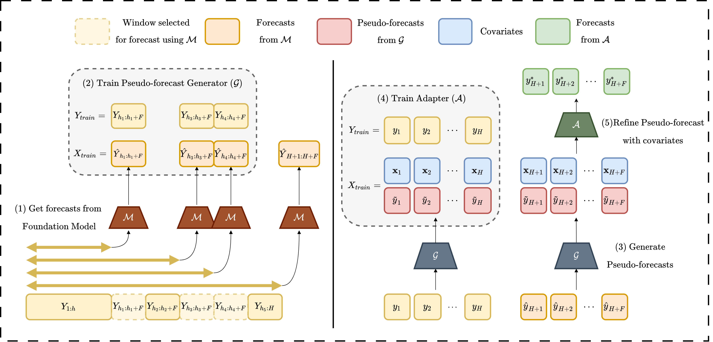
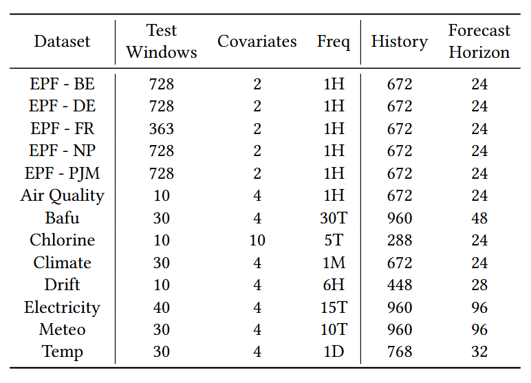
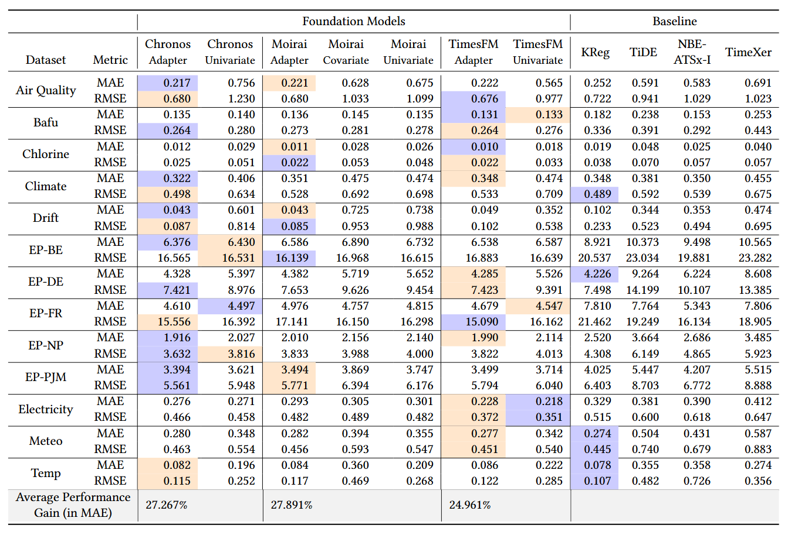

# TFMAdapter
## Lightweight Instance-Level Adaptation of Foundation Models for Forecasting with Covariates

✨ **Accepted to CIKM 2025** ✨

**Note**: This repository is based on the [GIFT-Eval codebase](https://github.com/SalesforceAIResearch/gift-eval).

## Overview

TFMAdapter is a lightweight adapter for Time Series Foundation Models (TSFMs) that enables instance-level forecasting with covariates without any fine-tuning of the base model. 

TFMAdapter works in two stages:
1. A pseudo-forecast generator trained on outputs from the base TSFM creates forecasts over history (labelled data for training adapter).
2. A Gaussian Process adapter refines these pseudo-forecasts using covariates to produce final forecasts.

## Adapter Architecture



## Running Experiments

```bash
CUDA_VISIBLE_DEVICES=$device python3 evaluate_model.py \
    -model_name $model_name \
    -dataset_names "ETTh1 ETTh2 ETTm1 ETTm2" \
    -batch_size 1024 \
    -dataset_config dataset_config2 \
    -num_past_k 4 \
    -pos_dims 16 \
    -use_positions \
    -model_config "${model}_adapter_with_cov" \
    -folds 1 \
    -adaptor_method "gaussian_process" \
    -log_subdir "logs"
```

- `model_name`: Hugging Face checkpoint (for Chronos, Moirai, or TimesFM)
- `dataset_config2.json`: Contains dataset configuration
- `model_config`: Use suffix `_adapter_with_cov` to add adapter; for baselines use:
  - `chronos_univariate`
  - `moirai_univariate`, `moirai_covariate`
  - `timesfm_univariate`

## Evaluation

### Datasets



### Results



## Citation

To be added.

```bibtex
```
